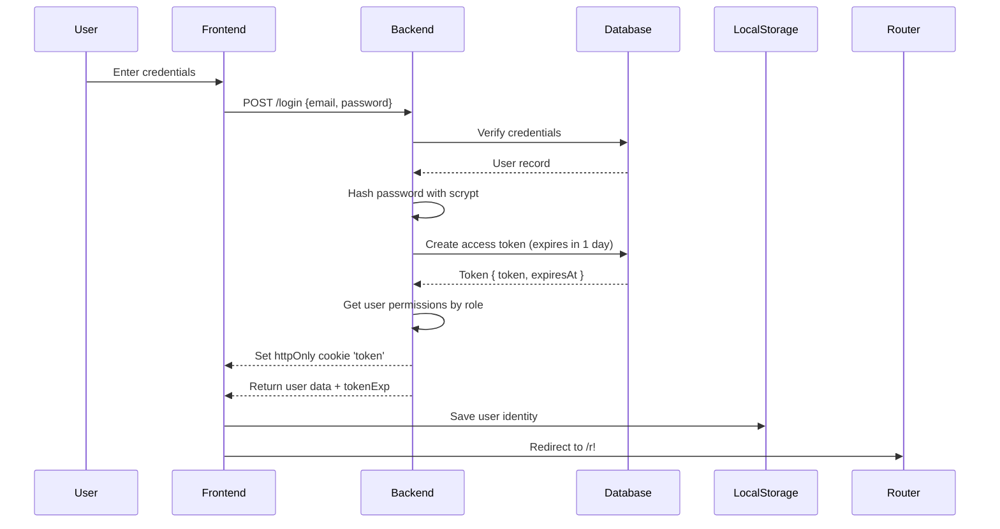
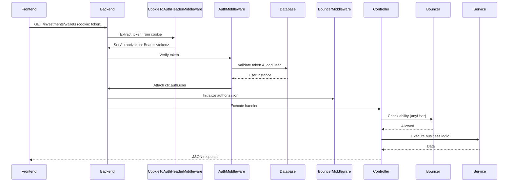

# Architecture Documentation

## Table of Contents
1. [Overview](#overview)
2. [Technology Stack](#technology-stack)
3. [Monorepo Structure](#monorepo-structure)
4. [Backend Architecture](#backend-architecture)
5. [Frontend Architecture](#frontend-architecture)
6. [Authentication & Authorization](#authentication--authorization)
7. [Database Schema](#database-schema)
8. [API Contracts](#api-contracts)
9. [Development Workflow](#development-workflow)
10. [Testing Strategy](#testing-strategy)

---

## Overview

**kdongs-mono** is a full-stack TypeScript monorepo application for personal finance management, specifically focused on investment portfolio tracking. The application allows users to manage investment wallets, track multiple asset types (stocks, bonds, etc.), monitor performance metrics, and handle multi-currency portfolios.

### Core Features
- **Wallet Management**: Create and manage multiple investment wallets with different currencies
- **Investment Tracking**: Support for Brazilian assets (SEFBFR stocks, public/private bonds)
- **Performance Analytics**: Real-time portfolio performance calculation with profit/loss tracking
- **Multi-Currency Support**: Handle investments in different currencies with conversion
- **Transaction History**: Track wallet movements (deposits, withdrawals)
- **User Authentication**: Secure token-based authentication with role-based access control

### Architecture Philosophy
- **Type Safety**: End-to-end TypeScript with strict mode enabled
- **Clean Architecture**: Separation of concerns with clear layer boundaries
- **Security First**: HTTP-only cookies, CORS configuration, input validation
- **Modern Stack**: Latest versions of AdonisJS (6.x) and Angular (21.x)
- **Monorepo Benefits**: Shared types, coordinated development, single source of truth

---

## Technology Stack

### Backend (API)
| Technology | Version | Purpose |
|------------|---------|---------|
| **AdonisJS** | 6.18.0 | Web framework & dependency injection |
| **Node.js** | Latest LTS | Runtime environment |
| **TypeScript** | 5.6.x | Type-safe language |
| **PostgreSQL** | 8.x | Relational database |
| **Lucid ORM** | Latest | Database ORM with migrations |
| **Vine** | Latest | Schema validation |
| **Bouncer** | Latest | Authorization & abilities |
| **Scrypt** | Latest | Password hashing |
| **Pino** | Latest | Structured logging |
| **Japa** | Latest | Testing framework |
| **Biome** | 2.2.2 | Linting & formatting |

### Frontend (SPA)
| Technology | Version | Purpose |
|------------|---------|---------|
| **Angular** | 21.0.0 | UI framework |
| **TypeScript** | 5.7.x | Type-safe language |
| **Tailwind CSS** | 4.1.17 | Utility-first styling |
| **Zod** | 3.x | Runtime schema validation |
| **Font Awesome** | 6.x | Icon library |
| **RxJS** | 7.x | Reactive programming |
| **Angular Signals** | Built-in | State management |
| **Vitest** | Latest | Testing framework |
| **Prettier** | Latest | Code formatting |

### Development Tools
- **npm workspaces** - Monorepo package management
- **Husky** - Git hooks for pre-commit validation
- **lint-staged** - Run linters on staged files
- **mprocs** - Run multiple processes concurrently
- **Docker** - PostgreSQL containerization

---

## Monorepo Structure

```
kdongs-mono/
├── packages/
│   ├── backend/          # AdonisJS API server
│   └── frontend/         # Angular SPA
├── docker/               # Docker configurations (WIP, excluded from analysis)
├── scripts/              # Utility scripts
├── .husky/               # Git hooks configuration
├── package.json          # Workspace root configuration
└── README.md            # Setup and usage documentation
```

### Workspace Scripts
The root `package.json` provides unified commands for development:

```json
{
  "dev:mono": "Run both frontend and backend concurrently",
  "dev:frontend": "Start Angular dev server",
  "dev:backend": "Start AdonisJS dev server",
  "dev:backend:docker-db-up": "Start PostgreSQL in Docker",
  "test:frontend": "Run Angular tests with Vitest",
  "test:backend": "Run AdonisJS tests with Japa"
}
```

### Pre-commit Hooks
- **Frontend**: Prettier formatting for `*.{ts,js,json,css,scss,html,md}`
- **Backend**: Biome formatting for `*.{ts,js,json,env,md}`

---

## Backend Architecture

### Directory Structure
```
packages/backend/
├── app/
│   ├── controllers/        # HTTP request handlers
│   ├── services/          # Business logic layer
│   ├── models/            # Lucid ORM models (database entities)
│   ├── validators/        # Vine validation schemas
│   ├── middleware/        # Request processing pipeline
│   ├── abilities/         # Bouncer authorization rules
│   ├── policies/          # Authorization policies
│   ├── exceptions/        # Error handling
│   └── core/
│       ├── types/         # Enums, constants, shared types
│       └── dto/           # Data Transfer Objects
├── config/                # Application configuration
├── database/
│   ├── migrations/        # Database schema versions
│   ├── seeders/          # Test data generation
│   └── factories/        # Model factories
├── start/
│   ├── routes.ts         # Route definitions
│   ├── kernel.ts         # Middleware stack
│   └── env.ts            # Environment validation
├── tests/
│   ├── unit/             # Unit tests
│   └── functional/       # API integration tests
└── bin/
    └── server.js         # Application entry point
```

### Architectural Layers

#### 1. Controllers (`app/controllers/`)
**Responsibility**: Handle HTTP requests, validate input, delegate to services, return responses

**Pattern**: Thin controllers with dependency injection
```typescript
@inject()
export default class WalletsController {
  constructor(private walletsService: WalletsService) {}

  async index({ request, response, auth, bouncer }: HttpContext) {
    // 1. Authorization check
    if (await bouncer.denies(anyUser)) return response.forbidden()

    // 2. Input validation
    const input = await request.validateUsing(IndexValidator)

    // 3. Business logic delegation
    const result = await this.walletsService.walletsList(input)

    // 4. Response formatting
    return response.ok(result)
  }
}
```

**Key Controllers**:
- `AuthController` - Login/logout endpoints
- `WalletsController` - Full REST resource for wallet CRUD
- `WalletsPerformanceController` - Portfolio analytics

#### 2. Services (`app/services/`)
**Responsibility**: Business logic, database operations, data transformation

**Pattern**: Single responsibility, dependency-free (or inject other services)
```typescript
export default class WalletsService {
  async walletsList(input: IndexRequest): Promise<IndexResponse> {
    // Database queries with Lucid ORM
    // Data transformations
    // Business rule enforcement
    return { data, metadata }
  }
}
```

**Key Services**:
- `AuthService` - Authentication logic, token management
- `WalletsService` - Wallet CRUD operations
- `PromiseBatch` - Utility for batching async operations
- `CurrencyConverter` - Exchange rate calculations
- Asset performance calculators (SEFBFR, bonds)

#### 3. Models (`app/models/`)
**Responsibility**: Database entity representation, relationships, query scopes

**Pattern**: Lucid ORM with UUID primary keys, soft deletes, timestamps
```typescript
export default class Wallet extends BaseModel {
  @column({ isPrimary: true })
  declare id: string

  @column()
  declare userId: string

  @belongsTo(() => User)
  declare user: BelongsTo<typeof User>

  @hasMany(() => WalletMovement)
  declare movements: HasMany<typeof WalletMovement>

  @beforeCreate()
  static assignUuid(wallet: Wallet) {
    wallet.id = uuidv7()
  }
}
```

**Key Models**:
- `User` - User authentication and profile
- `Wallet` - Investment wallet container
- `WalletMovement` - Deposits/withdrawals
- `AssetSefbfr` - Brazilian stock holdings
- `AssetBrlPublicBond` / `AssetBrlPrivateBond` - Bond investments

#### 4. Validators (`app/validators/`)
**Responsibility**: Input validation using Vine schema DSL

**Pattern**: Request/response validation with type inference
```typescript
export const IndexValidator = vine.compile(
  vine.object({
    page: vine.number().optional(),
    limit: vine.number().optional(),
    sortBy: vine.string().optional(),
    sortOrder: vine.enum(['asc', 'desc']).optional()
  })
)

export type IndexRequest = Infer<typeof IndexValidator>
```

#### 5. Middleware (`app/middleware/`)
**Responsibility**: Cross-cutting concerns in the request pipeline

**Middleware Stack** (see `start/kernel.ts`):
1. `ForceJsonResponseMiddleware` - Ensure JSON responses
2. `CookieToAuthHeaderMiddleware` - Convert cookie to Authorization header
3. `AuthMiddleware` - Verify bearer token
4. `InitializeBouncerMiddleware` - Setup authorization context
5. `TimeLoggerMiddleware` - Request timing logs

#### 6. Core Types & DTOs (`app/core/`)
**Responsibility**: Shared interfaces, enums, data contracts

**Structure**:
- `types/user/user_roles.ts` - User roles and permissions
- `types/investment/currencies.ts` - Supported currency codes
- `dto/auth/login_dto.ts` - Login request/response types
- `dto/investment/wallet/` - Wallet operation DTOs

### Key Design Patterns

#### 1. Dependency Injection
```typescript
// Service injection into controllers
@inject()
export default class WalletsController {
  constructor(private walletsService: WalletsService) {}
}
```

#### 2. Repository Pattern (via Lucid ORM)
```typescript
// Models act as repositories
const wallets = await Wallet.query()
  .where('userId', user.id)
  .preload('movements')
  .paginate(page, limit)
```

#### 3. Soft Deletes
```typescript
// Models include deletedAt timestamp
async softDelete() {
  this.deletedAt = DateTime.now()
  await this.save()
}
```

#### 4. UUID Primary Keys
```typescript
// All models use UUID v7 for IDs
@beforeCreate()
static assignUuid(model: Model) {
  model.id = uuidv7()
}
```

#### 5. DTO Pattern
```typescript
// Clear contracts between layers
export type LoginRequest = { email: string; password: string }
export type LoginResponse = {
  data: {
    userEmail: string;
    userName: string;
    tokenExp: number;
    allowedIn: string[]
  }
}
```

---

## Frontend Architecture

### Directory Structure
```
packages/frontend/src/app/
├── infra/                    # Infrastructure layer
│   ├── services/             # Core services
│   │   ├── identity/         # User authentication state
│   │   ├── theme/            # Dark/light theme management
│   │   ├── message/          # Toast notifications
│   │   └── viewport/         # Responsive layout
│   ├── gateways/             # API integration layer
│   │   ├── login/            # Authentication API
│   │   ├── investments/      # Investments API
│   │   └── shared/           # Base gateway class
│   └── guards/               # Route guards
│       ├── gatekeeper.guard.ts    # Authentication guard
│       └── authorization.guard.ts # Permission guard
├── pages/
│   ├── public/
│   │   └── landing/          # Login page
│   ├── private/
│   │   ├── landing.ts        # Authenticated app shell
│   │   ├── components/       # Shared components (topbar, sidebar)
│   │   └── modules/          # Feature modules
│   │       └── investments/  # Investment management feature
│   └── components/           # Global components
└── environments/             # Environment configuration
```

### Architectural Layers

#### 1. Components (`pages/`)
**Responsibility**: UI rendering, user interaction, local state

**Pattern**: Standalone components with signals
```typescript
@Component({
  selector: 'app-wallet',
  standalone: true,
  changeDetection: ChangeDetectionStrategy.OnPush,
  imports: [CommonModule, ReactiveFormsModule],
  templateUrl: './wallet.html',
  styleUrls: ['./wallet.scss']
})
export class WalletComponent {
  // Dependency injection via inject()
  private walletService = inject(WalletService)
  private gateway = inject(InvestmentsGatewayService)

  // Signal-based state
  wallets = signal<Wallet[]>([])
  isLoading = signal(false)

  // Computed derived state
  totalValue = computed(() =>
    this.wallets().reduce((sum, w) => sum + w.balance, 0)
  )

  constructor() {
    // Effect for reactive side effects
    effect(() => {
      this.loadWallets()
    })
  }
}
```

**Component Hierarchy**:
```
App (root)
├── MessageDocker (global toast container)
└── Router Outlet
    ├── Landing (public) - Login page
    └── Landing (private) - Authenticated shell
        ├── Topbar - Header navigation
        ├── SidebarModules - Feature navigation
        ├── LoadingBar - HTTP request indicator
        └── Router Outlet
            └── Investments (lazy-loaded)
                ├── Wallet - List view
                └── WalletPerformance - Analytics
```

#### 2. Services (`infra/services/`)
**Responsibility**: Shared state, business logic, cross-cutting concerns

**Infrastructure Services**:

**IdentityService** - User authentication state
```typescript
@Injectable({ providedIn: 'root' })
export class IdentityService {
  private _identity = signal<UserIdentity | null>(null)
  identity = this._identity.asReadonly()

  processIdentity(user: AuthenticatedUserDTO | null = null): boolean {
    // Validate token expiration
    // Store in localStorage keyed by host
    // Update signal state
  }

  clearAll(): void {
    // Clear signal and localStorage
  }
}
```

**ThemeManagerService** - Dark mode management
```typescript
@Injectable({ providedIn: 'root' })
export class ThemeManagerService {
  isDarkTheme = signal<boolean>(false)

  // Effect in app component updates DOM
}
```

**MessageManagerService** - Global notifications
```typescript
@Injectable({ providedIn: 'root' })
export class MessageManagerService {
  private messages = signal<Message[]>([])

  showSuccess(text: string): void
  showError(text: string): void
  showInfo(text: string): void
}
```

**Feature Services**:

**WalletService** - Wallet feature state
```typescript
@Injectable({ providedIn: 'root' })
export class WalletService {
  sidebarCollapsed = signal<boolean>(false)
  selectedWallets = signal<Map<string, Wallet>>(new Map())

  handleCollapse(): void
  resetSelectedWallets(): void
}
```

#### 3. Gateways (`infra/gateways/`)
**Responsibility**: API communication, request/response handling, validation

**Pattern**: Gateway pattern with Zod validation
```typescript
@Injectable({ providedIn: 'root' })
export class InvestmentsGatewayService extends DefaultGatewayService {
  listUserWallets(request: ListWalletsRequest): Observable<ListWalletsResponse> {
    return this._httpClient
      .get<unknown>(`${this._apiUrl}/investments/wallets`, { params })
      .pipe(
        map(response => ListWalletsResponseSchema.parse(response)),
        catchError(this._handleError.bind(this))
      )
  }
}
```

**Zod Schema Validation**:
```typescript
// Runtime validation of API responses
const ListWalletsResponseSchema = z.object({
  data: z.object({
    wallets: z.array(WalletSchema)
  }),
  metadata: z.object({
    page: z.number(),
    perPage: z.number(),
    total: z.number()
  })
})

type ListWalletsResponse = z.infer<typeof ListWalletsResponseSchema>
```

**DefaultGatewayService** - Base class
```typescript
export abstract class DefaultGatewayService {
  protected _httpClient = inject(HttpClient)
  protected _apiUrl = environment.apiUrl

  protected _handleError(error: HttpErrorResponse): Observable<never> {
    // Parse error response
    // Throw GatewayError with structured data
  }
}
```

#### 4. Guards (`infra/guards/`)
**Responsibility**: Route protection, authentication/authorization checks

**GatekeeperGuard** (Authentication):
```typescript
export const gatekeeperGuard: CanMatchFn = (route, segments) => {
  const identityService = inject(IdentityService)
  const router = inject(Router)

  const isAuthenticated = identityService.processIdentity()
  const isLoginRoute = segments[0]?.path === 'gate'

  if (!isAuthenticated && !isLoginRoute) {
    // Redirect to login
    return router.createUrlTree(['/gate'])
  }

  if (isAuthenticated && isLoginRoute) {
    // Redirect to app
    return router.createUrlTree(['/r!'])
  }

  return true
}
```

### Key Design Patterns

#### 1. Standalone Components (Angular 21)
- No `NgModules`, all components use `standalone: true` (default in v21)
- Direct imports in component metadata
- Lazy-loaded routes with `loadComponent()`

#### 2. Signal-Based State Management
```typescript
// Replace NgRx/RxJS state with signals
const count = signal(0)
const doubled = computed(() => count() * 2)

// Effects for side effects
effect(() => {
  console.log('Count is', count())
})

// Update state
count.set(1)
count.update(c => c + 1)
```

#### 3. Gateway Pattern
- Abstraction layer between components and HTTP
- Centralized error handling
- Response validation with Zod
- Type-safe API contracts

#### 4. Smart/Presentational Components
- **Smart components**: Handle data fetching, state management
- **Presentational components**: Pure UI rendering via inputs/outputs

#### 5. Reactive Forms
```typescript
form = new FormGroup({
  email: new FormControl('', [Validators.required, Validators.email]),
  password: new FormControl('', [Validators.required])
})
```

---

## Authentication & Authorization

### Authentication Flow

#### 1. Login Process


**Backend Token Creation** (`app/services/auth/auth_service.ts`):
```typescript
async login(input: LoginRequest): Promise<LoginResponse> {
  // 1. Verify credentials (email + scrypt hashed password)
  const user = await User.verifyCredentials(input.email, input.password)

  // 2. Create access token (1 day expiration)
  const token = await User.accessTokens.create(user, ['*'], {
    expiresIn: '1 day'
  })

  // 3. Get frontend permissions by role
  const permissions = frontendPermissionsbyUserRole[user.role]

  // 4. Return response with token in secure cookie
  return {
    data: {
      allowedIn: permissions,
      tokenExp: token.expiresAt.getTime(),
      userEmail: user.email,
      userName: user.name
    },
    secureCookie: {
      token: token.token
    }
  }
}
```

**Frontend Identity Management** (`infra/services/identity/identity.service.ts`):
```typescript
processIdentity(user: AuthenticatedUserDTO | null = null): boolean {
  // 1. Check in-memory state
  if (user === null && this._identity() !== null) {
    if (!this._isValid(this._identity()?.tokenExp ?? 0)) {
      this.clearAll()
      return false
    }
    return true
  }

  // 2. Recover from localStorage or use provided user
  const identityRead = user === null
    ? this._recoverUserIdentity()
    : user

  // 3. Validate token expiration
  if (!this._isValid(identityRead?.tokenExp ?? 0)) {
    this.clearAll()
    return false
  }

  // 4. Update signal state
  this._identity.set(identityRead)

  // 5. Save to localStorage (keyed by host)
  if (user !== null) this._saveUserIdentity()

  return true
}
```

#### 2. Protected Request Flow


**Middleware Stack** (`start/kernel.ts`):
```typescript
router.use([
  () => import('#middleware/force_json_response_middleware'),
  () => import('#middleware/cookie_to_auth_header_middleware'),
  () => import('#middleware/initialize_bouncer_middleware'),
  () => import('@adonisjs/core/bodyparser_middleware')
])
```

**Cookie to Authorization Header** (`app/middleware/cookie_to_auth_header_middleware.ts`):
```typescript
async handle(ctx: HttpContext, next: NextFn) {
  const token = ctx.request.cookie('token')
  if (token && !ctx.request.header('authorization')) {
    ctx.request.headers().authorization = `Bearer ${token}`
  }
  await next()
}
```

### Authorization (Bouncer)

#### User Roles
```typescript
enum UserRole {
  USER = 'user',
  ADMIN = 'admin'
}

// Frontend permissions by role
frontendPermissionsbyUserRole = {
  admin: ['INVESTMENTS_ACCESS'],
  user: ['INVESTMENTS_ACCESS']
}
```

#### Abilities (`app/abilities/main.ts`)
```typescript
export const onlyAdmin = Bouncer.ability((user: User) =>
  user.role === 'admin'
)

export const onlyUser = Bouncer.ability((user: User) =>
  user.role === 'user'
)

export const anyUser = Bouncer.ability((user: User) =>
  user.role === 'user' || user.role === 'admin'
)
```

#### Controller Usage
```typescript
async index({ bouncer, response }: HttpContext) {
  if (await bouncer.denies(anyUser)) {
    return response.forbidden({ error: 'Access denied' })
  }
  // ... proceed with logic
}
```

#### Frontend Route Guards
```typescript
export const gatekeeperGuard: CanMatchFn = (route, segments) => {
  const identityService = inject(IdentityService)
  const isAuthenticated = identityService.processIdentity()

  // Protect private routes
  // Redirect authenticated users away from login

  return true // or router.createUrlTree([...])
}
```

### Security Features

1. **HTTP-only Cookies**: Token stored in HTTP-only cookie (not accessible to JavaScript)
2. **CORS Configuration**: Credentials allowed, origin validation
3. **Password Hashing**: Scrypt algorithm (stronger than bcrypt)
4. **Token Expiration**: 1-day expiration with countdown tracking
5. **CSRF Protection**: Cookie-based auth with same-origin policy
6. **Input Validation**: Vine validators on all endpoints
7. **Output Validation**: Zod schemas on frontend for API responses

---

## Database Schema

### Entity Relationship Diagram
```
┌─────────────┐
│    User     │
├─────────────┤
│ id (UUID)   │ PK
│ name        │
│ email       │ UNIQUE
│ password    │ Scrypt hashed
│ role        │ user | admin
│ createdAt   │
│ updatedAt   │
│ deletedAt   │ Soft delete
└──────┬──────┘
       │ 1
       │
       │ *
┌──────▼──────────┐
│     Wallet      │
├─────────────────┤
│ id (UUID)       │ PK
│ userId (UUID)   │ FK → User.id
│ name            │
│ currencyCode    │ USD, BRL, EUR
│ createdAt       │
│ updatedAt       │
│ deletedAt       │ Soft delete
└──────┬──────────┘
       │ 1
       ├────────────────────────┬────────────────────┬───────────────────┐
       │ *                      │ *                  │ *                 │ *
┌──────▼────────────┐  ┌────────▼────────┐  ┌───────▼──────────┐  ┌────▼─────────────┐
│ WalletMovement    │  │  AssetSefbfr    │  │AssetBrlPublicBond│  │AssetBrlPrivateBond│
├───────────────────┤  ├─────────────────┤  ├──────────────────┤  ├──────────────────┤
│ id (UUID)         │  │ id (UUID)       │  │ id (UUID)        │  │ id (UUID)        │
│ walletId (UUID)   │  │ walletId (UUID) │  │ walletId (UUID)  │  │ walletId (UUID)  │
│ type              │  │ assetName       │  │ assetName        │  │ assetName        │
│ resultAmount      │  │ holderInstitute │  │ issueRate        │  │ issueRate        │
│ dateUtc           │  │ doneState       │  │ maturityDate     │  │ maturityDate     │
│ createdAt         │  │ createdAt       │  │ createdAt        │  │ createdAt        │
│ updatedAt         │  │ updatedAt       │  │ updatedAt        │  │ updatedAt        │
└───────────────────┘  └────────┬────────┘  └──────────────────┘  └──────────────────┘
                                │ 1
                                ├────────────┬─────────────┬──────────────┬─────────────┐
                                │ *          │ *           │ *            │ *           │ *
                       ┌────────▼─────┐  ┌──▼──────┐  ┌──▼────────┐  ┌──▼────────┐  ┌──▼────────┐
                       │AssetSefbfrBuy│  │...Sell  │  │...Transfer│  │...Dividend│  │...Split   │
                       └──────────────┘  └─────────┘  └───────────┘  └───────────┘  └───────────┘
                                        (+ BonusShare, Inplit)
```

### Key Tables

#### Users
```sql
CREATE TABLE users (
  id UUID PRIMARY KEY,
  name VARCHAR NOT NULL,
  email VARCHAR UNIQUE NOT NULL,
  password VARCHAR NOT NULL,  -- Scrypt hashed
  role VARCHAR CHECK(role IN ('user', 'admin')) DEFAULT 'user',
  created_at TIMESTAMP DEFAULT NOW(),
  updated_at TIMESTAMP DEFAULT NOW(),
  deleted_at TIMESTAMP NULL
);
```

#### Wallets
```sql
CREATE TABLE wallets (
  id UUID PRIMARY KEY,
  user_id UUID REFERENCES users(id) ON DELETE CASCADE,
  name VARCHAR NOT NULL,
  currency_code VARCHAR(3) NOT NULL,  -- USD, BRL, EUR, etc.
  created_at TIMESTAMP DEFAULT NOW(),
  updated_at TIMESTAMP DEFAULT NOW(),
  deleted_at TIMESTAMP NULL
);
```

#### Wallet Movements
```sql
CREATE TABLE wallet_movements (
  id UUID PRIMARY KEY,
  wallet_id UUID REFERENCES wallets(id) ON DELETE CASCADE,
  type VARCHAR NOT NULL,  -- deposit, withdrawal
  result_amount DECIMAL(20, 8) NOT NULL,
  date_utc TIMESTAMP NOT NULL,
  created_at TIMESTAMP DEFAULT NOW(),
  updated_at TIMESTAMP DEFAULT NOW()
);
```

### Migrations Strategy
- **Version Control**: Each migration is timestamped and tracked
- **Rollback Support**: Down migrations for reversibility
- **Environment Separation**: Separate databases for `.env` and `.env.test`
- **Seeding**: Test data generation via seeders
- **Factories**: Model factories for test data

**Migration Example**:
```typescript
export default class CreateWalletsTable extends BaseSchema {
  async up() {
    this.schema.createTable('wallets', (table) => {
      table.uuid('id').primary()
      table.uuid('user_id').references('users.id').onDelete('CASCADE')
      table.string('name').notNullable()
      table.string('currency_code', 3).notNullable()
      table.timestamp('created_at')
      table.timestamp('updated_at')
      table.timestamp('deleted_at').nullable()
    })
  }

  async down() {
    this.schema.dropTable('wallets')
  }
}
```

---

## API Contracts

### Base URL
- **Development**: `http://localhost:3333`
- **Production**: TBD

### Authentication Endpoints

#### POST /login
**Description**: Authenticate user and create access token

**Request**:
```json
{
  "email": "user@example.com",
  "password": "securePassword123"
}
```

**Response** (200 OK):
```json
{
  "data": {
    "userEmail": "user@example.com",
    "userName": "John Doe",
    "tokenExp": 1704067200000,
    "allowedIn": ["INVESTMENTS_ACCESS"]
  }
}
```

**Headers**:
- `Set-Cookie: token=<jwt>; HttpOnly; Secure; SameSite=Strict`

**Errors**:
- `400` - Invalid credentials
- `422` - Validation error

---

#### POST /logout
**Description**: Invalidate current access token

**Headers**:
- `Cookie: token=<jwt>` (or `Authorization: Bearer <token>`)

**Response** (204 No Content)

---

### Investment Endpoints

All endpoints require authentication (Cookie or Authorization header)

#### GET /investments/wallets
**Description**: List user's wallets with pagination

**Query Parameters**:
```typescript
{
  page?: number          // Default: 1
  limit?: number         // Default: 10
  sortBy?: string        // Default: 'createdAt'
  sortOrder?: 'asc' | 'desc'  // Default: 'desc'
}
```

**Response** (200 OK):
```json
{
  "data": {
    "wallets": [
      {
        "id": "uuid-v7",
        "name": "My Portfolio",
        "currencyCode": "USD",
        "createdAt": "2024-01-01T00:00:00.000Z"
      }
    ]
  },
  "metadata": {
    "page": 1,
    "perPage": 10,
    "total": 25,
    "totalPages": 3,
    "hasMorePages": true
  }
}
```

---

#### POST /investments/wallets
**Description**: Create new wallet (step 1: get available currencies)

**Response** (200 OK):
```json
{
  "data": {
    "availableCurrencies": ["USD", "BRL", "EUR", "GBP"]
  }
}
```

---

#### POST /investments/wallets (store)
**Description**: Create new wallet (step 2: store wallet)

**Request**:
```json
{
  "name": "My Portfolio",
  "currencyCode": "USD",
  "userId": "uuid-v7"
}
```

**Response** (201 Created):
```json
{
  "data": {
    "wallet": {
      "id": "uuid-v7",
      "name": "My Portfolio",
      "currencyCode": "USD",
      "createdAt": "2024-01-01T00:00:00.000Z"
    }
  }
}
```

---

#### GET /investments/wallets/:id
**Description**: Get single wallet details

**Response** (200 OK):
```json
{
  "data": {
    "wallet": {
      "id": "uuid-v7",
      "name": "My Portfolio",
      "currencyCode": "USD",
      "movements": [...],
      "assets": [...]
    }
  }
}
```

---

#### PUT /investments/wallets/:id
**Description**: Update wallet

**Request**:
```json
{
  "name": "Updated Portfolio Name",
  "currencyCode": "EUR"
}
```

**Response** (200 OK)

---

#### DELETE /investments/wallets/:id
**Description**: Soft delete wallet

**Response** (204 No Content)

---

#### GET /investments/performance
**Description**: Calculate portfolio performance metrics

**Query Parameters**:
```typescript
{
  walletIds: string[]  // Array of wallet UUIDs
}
```

**Response** (200 OK):
```json
{
  "data": {
    "indicators": {
      "totalBalance": "125000.50",
      "totalProfit": "25000.50",
      "profitPercent": "25.00"
    },
    "series": [
      {
        "date": "2024-01-01",
        "balance": "100000.00"
      }
    ],
    "wallets": [
      {
        "id": "uuid-v7",
        "name": "My Portfolio",
        "currentBalance": "125000.50",
        "profit": "25000.50",
        "profitPercent": "25.00"
      }
    ]
  }
}
```

---

### Error Responses

**Standard Error Format**:
```json
{
  "error": "Error message",
  "errors": [
    {
      "field": "email",
      "message": "Email is required",
      "rule": "required"
    }
  ]
}
```

**Status Codes**:
- `400` - Bad Request (invalid input)
- `401` - Unauthorized (missing/invalid token)
- `403` - Forbidden (insufficient permissions)
- `404` - Not Found
- `422` - Validation Error
- `500` - Internal Server Error

---

## Development Workflow

### Initial Setup

1. **Clone Repository**
```bash
git clone https://github.com/lfsc09/kdongs-mono.git
cd kdongs-mono
```

2. **Install Dependencies**
```bash
npm install
```

3. **Backend Setup**
```bash
npm run dev:setup
# This creates .env files and generates APP_KEY and DB credentials
```

4. **Start PostgreSQL**
```bash
npm run dev:backend:docker-db-up
```

5. **Run Migrations**
```bash
npm run dev:backend:migrate
npm run test:backend:migrate
```

### Development Commands

**Run Both Frontend & Backend**:
```bash
npm run dev:mono
# Uses mprocs to run both concurrently
```

**Run Individually**:
```bash
npm run dev:frontend  # Angular on http://localhost:4200
npm run dev:backend   # AdonisJS on http://localhost:3333
```

**Database Management**:
```bash
npm run dev:backend:docker-db-up      # Start PostgreSQL
npm run dev:backend:docker-db-down    # Stop and remove PostgreSQL
npm run dev:backend:migrate           # Run migrations (dev DB)
```

**Code Quality**:
```bash
npm run dev:frontend:format  # Prettier (frontend)
npm run dev:backend:format   # Biome (backend)
```

**Testing**:
```bash
npm run test:frontend              # Vitest (Angular)
npm run test:backend               # Japa (AdonisJS)
npm run test:backend:migrate       # Migrate test database
```

### Git Workflow

**Pre-commit Hooks** (via Husky + lint-staged):
- Automatically formats staged files before commit
- Frontend: Prettier
- Backend: Biome

**Branch Strategy** (inferred from git status):
- Main branch: `main`
- Feature branches: `feat/*`
- Current: `feat/deployment-to-vps`

### Environment Variables

**Backend** (`.env`):
```env
PORT=3333
HOST=0.0.0.0
NODE_ENV=development
APP_KEY=<generated>
DB_HOST=127.0.0.1
DB_PORT=5432
DB_USER=root
DB_PASSWORD=<generated>
DB_DATABASE=kdongs
```

**Frontend** (`src/environments/environment.development.ts`):
```typescript
export const environment = {
  title: 'Kdongs',
  host: 'localhost',
  apiUrl: 'http://localhost:3333',
  tokenLifeSpan: 86400000,  // 1 day in ms
  tokenRefreshInterval: 60000  // 1 minute
}
```

---

## Testing Strategy

### Backend Testing (Japa)

**Structure**:
- `tests/unit/` - Unit tests (services, utilities)
- `tests/functional/` - API integration tests (controllers, routes)

**Test Database**:
- Separate database for testing (`.env.test`)
- Fresh migrations before each test run
- No seeding (tests create their own data)

**Example Test**:
```typescript
test.group('Wallets API', (group) => {
  group.each.setup(async () => {
    // Setup: create test user, login, etc.
  })

  test('GET /investments/wallets returns user wallets', async ({ client }) => {
    const response = await client
      .get('/investments/wallets')
      .cookie('token', testToken)

    response.assertStatus(200)
    response.assertBodyContains({ data: { wallets: [] } })
  })
})
```

### Frontend Testing (Vitest)

**Structure**:
- Component tests: `*.spec.ts` next to components
- Service tests: `*.spec.ts` next to services

**Test Environment**:
- Vitest with jsdom for DOM simulation
- Angular testing utilities

**Example Test**:
```typescript
describe('IdentityService', () => {
  let service: IdentityService

  beforeEach(() => {
    TestBed.configureTestingModule({})
    service = TestBed.inject(IdentityService)
  })

  it('should validate token expiration', () => {
    const expiredUser = {
      tokenExp: Date.now() - 1000,  // Expired
      // ...
    }

    expect(service.processIdentity(expiredUser)).toBe(false)
  })
})
```

### Testing Best Practices

1. **Isolation**: Each test is independent
2. **AAA Pattern**: Arrange, Act, Assert
3. **Mocking**: Mock external dependencies (database, HTTP, etc.)
4. **Coverage**: Aim for >80% coverage on critical paths
5. **CI Integration**: Tests run on pre-commit and CI/CD

---

## Deployment Considerations

### Backend Deployment
- **Build**: `npm run build` → compiles to `build/` directory
- **Environment**: Production `.env` with secure `APP_KEY`
- **Database**: PostgreSQL (managed or self-hosted)
- **Process Manager**: PM2 or systemd
- **Migrations**: Run `node ace migration:run --force` on deploy
- **CORS**: Update allowed origins for production domain

### Frontend Deployment
- **Build**: `npm run build` → outputs to `dist/`
- **Serve**: Static files via Nginx/Apache/CDN
- **Environment**: Production `environment.ts` with API URL
- **Routing**: Configure SPA fallback (`index.html` for all routes)

### Docker Deployment
- Work in progress in `docker/` folder
- Planned: Multi-stage builds for frontend/backend
- Nginx reverse proxy
- PostgreSQL service
- Docker Compose orchestration

---

## Summary

This monorepo architecture provides a robust foundation for a full-stack investment management application with:

✅ **Type Safety**: End-to-end TypeScript with strict mode
✅ **Modern Stack**: Latest Angular and AdonisJS versions
✅ **Clean Architecture**: Clear separation of concerns
✅ **Security**: Token-based auth, HTTP-only cookies, input validation
✅ **Scalability**: Modular structure, lazy loading, database optimization
✅ **Developer Experience**: Monorepo tooling, pre-commit hooks, hot reload
✅ **Testing**: Comprehensive test coverage with Japa and Vitest

The architecture supports future growth with patterns for adding new features, asset types, and integrations while maintaining code quality and security standards.
